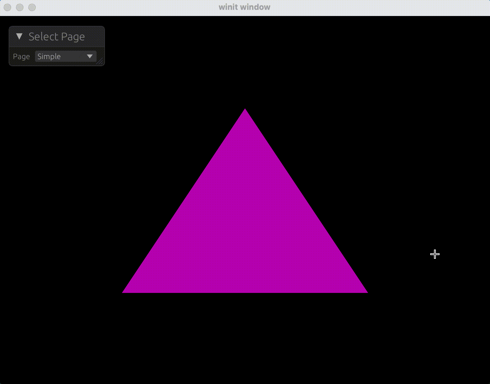

### Wgpu Egui Tokio 模版

#### 项目简介  

这是一个基于 [wgpu](https://github.com/gfx-rs/wgpu-rs)、[egui](https://github.com/emilk/egui) 和 [tokio](https://github.com/tokio-rs/tokio) 的集成模板项目，旨在为开发者提供一个快速入门的学习框架。通过该模板，用户可以高效地掌握 `wgpu` 的图形渲染能力，并结合 `egui` 实现交互式参数调整功能。

- **wgpu**：用于构建高性能的图形渲染管线，支持跨平台的现代图形 API（如 Vulkan、Metal、DX12）。  
- **egui**：轻量级即时模式 GUI 库，提供简洁的 API 用于实时参数调试和交互界面设计。  
- **tokio**：异步运行时框架，支持并发任务处理，适合需要后台逻辑（如网络请求或数据处理）的场景。  

#### 适用场景  

在开发图形应用或实验性项目时，常需动态调整参数（如着色器参数、渲染设置等）。`egui` 的即时交互特性与 `wgpu` 的渲染能力完美结合，使开发者能够快速验证想法并优化效果。此模板通过预置基础结构，显著降低学习成本，帮助开发者专注于实现具体功能。

#### 核心功能

本模版抽象出了两个主要Trait:

- `Page`
- `Render`

```rust
pub trait Render {
    fn ui_draw(&mut self, ctx: &egui::Context) {
        let _ = ctx;
    }

    fn handle_event(&mut self, event: winit::event::WindowEvent, state: &WgpuState) {
        let _ = event;
        let _ = state;
    }

    fn render(
        &self,
        state: &WgpuState,
        view: &TextureView,
        encoder: &mut CommandEncoder,
    ) -> anyhow::Result<()> {
        let _ = state;
        let _ = view;
        let _ = encoder;
        Ok(())
    }
}

pub trait Page: Render {
    type Message;

    fn new(state: &WgpuState, sender: Sender<Self::Message>) -> Self
    where
        Self: Sized;

    fn update(&mut self, message: Self::Message, state: &WgpuState) {
        let _ = message;
        let _ = state;
    }
}
```

通过实现`Page`和`Render` Trait，可以快速创建新的页面和渲染器。每个页面都可以独立处理自己的事件和渲染逻辑，便于模块化开发。`ui_draw`方法用于绘制UI组件，`handle_event`方法用于处理窗口事件，`render`方法用于执行渲染操作。

#### 示例代码与演示

下面是一个绘制三角形的示例代码片段：

着色器代码如下：

```wgsl
@vertex
fn vs(@builtin(vertex_index) vertex_index: u32) -> @builtin(position) vec4f {
    let ops = array(vec2f(0.0, 0.5), vec2f(-0.5, -0.5), vec2f(0.5, -0.5));
    return vec4f(ops[vertex_index], 0.0, 1.0);
}

@fragment
fn fs() -> @location(0) vec4f {
    return vec4f(0.5, 0.0, 0.5, 1.0);
}

```

实现`Page`和`Render` Trait的代码如下：

```rust
use wgpu_egui_tokio::{
    Page, Render, WgpuState,
    wgpu::{self, include_wgsl},
};

pub struct Simple {
    pub pipeline: wgpu::RenderPipeline,
}

impl Page for Simple {
    type Message = ();
    fn new(
        WgpuState { device, config, .. }: &wgpu_egui_tokio::WgpuState,
        _sender: tokio::sync::mpsc::Sender<Self::Message>,
    ) -> Self
    where
        Self: Sized,
    {
        let shader = device.create_shader_module(include_wgsl!("trangle.wgsl"));
        let pipeline = device.create_render_pipeline(&wgpu::RenderPipelineDescriptor {
            label: Some("triangle"),
            layout: None,
            vertex: wgpu::VertexState {
                module: &shader,
                entry_point: Some("vs"),
                compilation_options: Default::default(),
                buffers: &[],
            },
            fragment: Some(wgpu::FragmentState {
                module: &shader,
                entry_point: Some("fs"),
                compilation_options: Default::default(),
                targets: &[Some(wgpu::ColorTargetState {
                    format: config.format,
                    blend: Some(wgpu::BlendState::REPLACE),
                    write_mask: wgpu::ColorWrites::ALL,
                })],
            }),
            primitive: Default::default(),
            multisample: Default::default(),
            depth_stencil: None,
            multiview: None,
            cache: None,
        });
        Self { pipeline }
    }
}

impl Render for Simple {
    fn render(
        &self,
        _state: &WgpuState,
        view: &wgpu::TextureView,
        encoder: &mut wgpu::CommandEncoder,
    ) -> anyhow::Result<()> {
        let mut pass = encoder.begin_render_pass(&wgpu::RenderPassDescriptor {
            label: Some("Render Pass"),
            color_attachments: &[Some(wgpu::RenderPassColorAttachment {
                view,
                resolve_target: None,
                ops: wgpu::Operations {
                    load: wgpu::LoadOp::Load,
                    store: wgpu::StoreOp::Store,
                },
            })],
            depth_stencil_attachment: None,
            timestamp_writes: None,
            occlusion_query_set: None,
        });
        pass.set_pipeline(&self.pipeline);
        pass.draw(0..3, 0..1);
        Ok(())
    }
}

```



具体使用方法请参考项目中的 [`examples`](https://github.com/yexiyue/wgpu-egui-tokio/tree/main/examples/image-texture/src) 目录，该目录包含完整的代码示例，可作为实际开发的参考模板。
